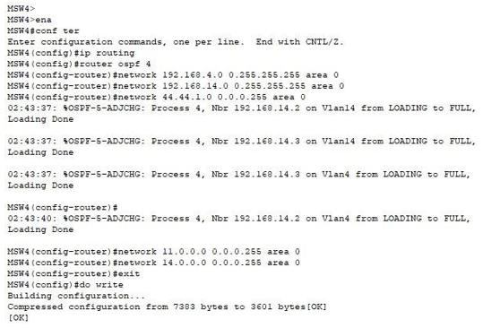

UNIVERSIDAD DE SAN CARLOS DE GUATEMALA

FACULTAD DE INGENIERIA

ESCUELA DE CIENCIAS Y SISTEMAS

LABORATORIO DE REDES Y COMPUTADORAS 2

SEGUNDO SEMESTRE 2023
 

---

---

---

---

---

---

---

 <h1>PROYECTO #2</h1> 
 

---

---

---

---

| Nombre   |      Carnet      |  
|----------|:-------------:|
| Daniel Estuardo Chicas Carías    | 201807079 | 

---

---

---

---

---

---

---

---

---

 <h1>COMANDOS UTILIZADOS</h1> 
 

| **Objetivo/Requerimiento** | **Comandos de Configuración** |
| --- | --- |
| **Configuración Básica** | |
| Asignar nombres a los dispositivos | `hostname <nombre_dispositivo>` |
| Configurar las interfaces | `interface <tipo> <número>` `ip address <dirección_ip> <máscara>` `no shutdown` |
| Configurar contraseñas | `enable password <contraseña>` `enable secret <contraseña>` `line console 0` `password <contraseña>` `login` `line vty 0 15` `password <contraseña>` `login` |
| Configurar el reloj (opcional) | `clock set <hora>` |
| **Configuración BGP** | |
| Configurar BGP en el router de interconexión de ISPs | `router bgp <número_ASN>` `neighbor <IP_vecino> remote-as <número_ASN_vecino>` |
| Configurar redes a anunciar en BGP | `network <red>` |
| **Configuración OSPF** | |
| Configurar OSPF en el router Akado | `router ospf <número_proceso>` `network <red> <wildcard_mask> area <número_area>` |
| **Configuración RIP** | |
| Configurar RIP en el router Akado | `router rip` `version 2` `network <red>` |
| **Configuración LACP** | |
| Configurar LACP en interfaces deseadas | `interface range <tipo> <número_inicio> - <número_fin>` `channel-group <número_grupo> mode active` |
| **Configuración EIGRP** | |
| Configurar EIGRP en el router Yota y Rostelecom | `router eigrp <número_proceso>` `network <red>` |
| **Configuración de Subredes** | |
| Configurar subredes para Akado | `interface <tipo> <número>` `ip address <dirección_ip> <máscara>` `ip helper-address <IP_DHCP>` |
| **Configuración de IPv6** | |
| Configurar IPv6 en interfaces deseadas | `interface <tipo> <número>` `ipv6 address <dirección_ipv6>` |
| **Configuración de Túneles IPv6 sobre IPv4** | |
| Configurar túneles IPv6 sobre IPv4 | `interface tunnel <número>` `tunnel source <dirección_ipv4>` `tunnel destination <dirección_ipv4_destino>` `ipv6 address <dirección_ipv6>` |
| **Configuración de Comunicación entre Departamentos** | |
| Configurar rutas estáticas o protocolos de enrutamiento para la comunicación entre departamentos | `ip route <red_destino> <máscara> <próximo_salto>`  (o)`router rip` `redistribute connected` |

 <h1>CAPTURAS DE PANTALLA</h1> 
 

---
---

  

---
--- 

  

---
---

  

---
---
# VLAN

  

---
---
# ASIGNACIÓN IP A VLAN

  

---
---

# VTP

  

---
---

# OSPF

  

---
---